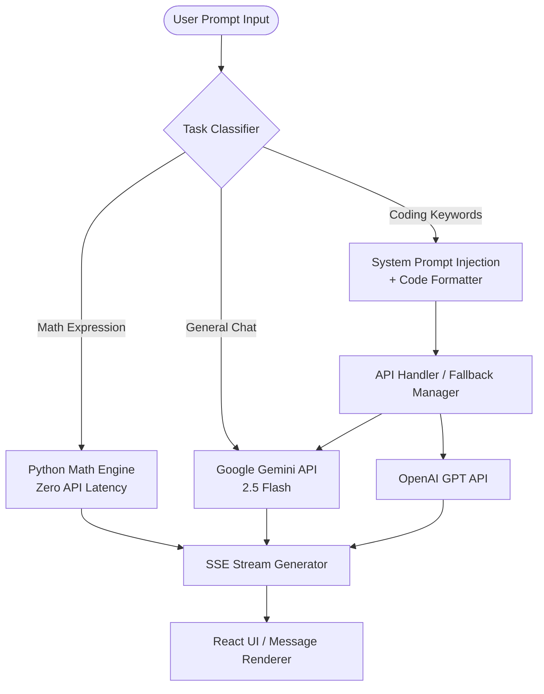

<p align="center">
  
</p>

<h1 align="center">⚡ SaraBot — Intelligent Vibe Coding & AI Multi-Model Agent ⚡</h1>

<p align="center">
  <strong>An advanced full-stack AI chatbot and multi-model router powered by Google Gemini, OpenAI GPT, and a high-performance Python Math Engine.</strong>
</p>

<p align="center">
  
  
  
  
  
</p>

---

## 📖 Table of Contents
- [Overview](#-overview)
- [Key Features](#-key-features)
- [Architecture & Routing Logic](#-architecture--routing-logic)
- [Folder & Project Structure](#-folder--project-structure)
- [Technical Stack](#-technical-stack)
- [Installation & Implementation Guide](#-installation--implementation-guide)
- [API Reference](#-api-reference)
- [Challenges Faced & Solutions (Problem Solving)](#-challenges-faced--solutions-problem-solving)
- [Keyboard Shortcuts](#-keyboard-shortcuts)
- [License & Contributing](#-license--contributing)

---

## 🌟 Overview

**SaraBot** is an ultra-fast, intelligent AI companion built for developers, creators, and power users. Instead of locking you into a single AI model, SaraBot features an **Intelligent Task Router** that automatically classifies incoming prompts and delegates them to the most suitable engine:
- **Coding & Technical Architecture:** High-precision coding prompts wrapped in automated system prompts for clean, copyable code blocks.
- **General Conversations & Explanations:** Real-time conversational streams powered by Google Gemini 2.5 Flash.
- **Math & Arithmetic Calculations:** Instant computation through an isolated, zero-latency Python AST arithmetic parser (no API roundtrip needed).

---

## 🚀 Key Features

### 🧠 Smart Model Routing & Execution
- **Auto Rotate Mode:** Detects coding keywords (`react`, `function`, `api`, `debug`, `sql`, etc.) and routes them to optimal models.
- **Model Override Controls:** Switch on-the-fly between **Auto Rotate**, **Gemini**, or **ChatGPT**.
- **Side-by-Side Model Arena (`CompareModal`):** Run the same prompt simultaneously against two models with live side-by-side stream comparison to benchmark response quality and latency.
- **Instant Math Engine:** Evaluates expressions (e.g., `15% of 240`, `sqrt(144) * 12`, `2^10`) locally with zero token consumption.

### 💻 Developer-First UI / UX
- **Futuristic Cyberpunk Aesthetic:** Deep dark theme (`#0A0A0A`), crisp typography (`Orbitron` & `Space Grotesk`), and vibrant amber/orange accents.
- **Live Server-Sent Events (SSE) Streaming:** Low-latency token-by-token streaming with live "Preparing..." indicator.
- **Syntax Highlighting & One-Click Copy:** Automatic code block detection with copy feedback.
- **Persistent Chat History:** Full session persistence via browser `localStorage` with auto-naming, session deletion, and markdown export.

---

## 🏗️ Architecture & Routing Logic



---

## 📁 Folder & Project Structure

```
Ai CHAT BOT/
│
├── logo.png                       # High-resolution SaraBot AI emblem
├── README.md                      # Comprehensive project documentation
├── FILE_STRUCTURE.md              # Detailed source file index
├── SETUP.md                       # Quick installation instructions
├── .gitignore                     # Git ignore rules for node_modules, .env, pycache
│
├── backend/                       # Python Flask API & AI Routing Service
│   ├── app.py                     # Main Flask server, SSE streaming routes (/api/chat, /api/compare)
│   ├── router.py                  # Task classification, prompt injection, and multi-model dispatch
│   ├── math_engine.py             # Safe, local AST math evaluation engine
│   ├── test_api.py                # Backend unit tests and connection health checks
│   ├── requirements.txt           # Python dependencies (flask, flask-cors, requests, python-dotenv)
│   ├── .env                       # Environment variables (API keys - excluded from git)
│   └── .env.example               # Template for environment configuration
│
└── frontend/                      # React 18 + Vite Single Page Application
    ├── index.html                 # HTML shell with custom fonts & meta tags
    ├── vite.config.js             # Vite build & dev server config
    ├── tailwind.config.js         # Custom Tailwind theme (colors, Orbitron font family)
    ├── postcss.config.js          # PostCSS configuration
    ├── package.json               # Frontend dependencies & scripts
    │
    └── src/
        ├── main.jsx               # React DOM entry point
        ├── App.jsx                # Core application layout, SSE consumer & state coordinator
        ├── index.css              # Global styles, Tailwind directives & custom scrollbars
        │
        ├── assets/
        │   └── logo.png           # SaraBot branding assets
        │
        ├── components/            # Modular React UI Components
        │   ├── Header.jsx         # App header with logo, mobile sidebar toggle & Compare button
        │   ├── Sidebar.jsx        # Session list, new chat trigger, search & export actions
        │   ├── ChatArea.jsx       # Scrollable chat thread & welcome quick-actions
        │   ├── Message.jsx        # Message bubble, code syntax blocks & metadata badges
        │   ├── InputArea.jsx      # Auto-expanding textarea, model selector & submit button
        │   ├── CompareModal.jsx   # Side-by-side dual model comparison dialog
        │   ├── AboutModal.jsx     # System information & model details modal
        │   └── Logos.jsx          # SVG brand icons for Gemini & ChatGPT
        │
        └── utils/
            └── storage.js         # LocalStorage persistence helpers for chat sessions
```

---

## 🛠️ Technical Stack

| Layer | Technology | Purpose |
|---|---|---|
| **Frontend Framework** | React 18 + Vite | Lightning-fast reactive user interface |
| **Styling** | Tailwind CSS + Lucide Icons | Responsive modern cyberpunk dark theme |
| **Backend Framework** | Python 3 + Flask + Flask-CORS | API server with Server-Sent Events (SSE) |
| **AI Providers** | Google Gemini 2.5 Flash, OpenAI GPT | Multi-model intelligence & code generation |
| **Computation Engine** | Python AST Math Engine | Sub-millisecond instant math calculations |
| **Storage** | Browser LocalStorage | Zero-database client-side privacy & persistence |

---

## ⚙️ Installation & Implementation Guide

### Prerequisites
- **Node.js**: v18.x or higher
- **Python**: v3.8 or higher
- **Google Gemini API Key** ([Get free key at Google AI Studio](https://aistudio.google.com/))
- **OpenAI API Key** *(Optional)*

### Step 1: Clone Repository
```bash
git clone https://github.com/Faisal-rabani/Saga-Bot.git
cd "Ai CHAT BOT"
```

### Step 2: Backend Setup
```bash
cd backend
python -m venv venv

# On Windows:
venv\Scripts\activate
# On macOS/Linux:
# source venv/bin/activate

pip install -r requirements.txt
```

Create `backend/.env` file:
```env
GEMINI_API_KEY=your_google_gemini_api_key_here
OPENAI_API_KEY=your_openai_api_key_here
FLASK_ENV=development
```

Start the Flask server:
```bash
python app.py
```
*Backend runs on `http://localhost:5000`*

### Step 3: Frontend Setup
Open a new terminal:
```bash
cd frontend
npm install
npm run dev
```
*Frontend runs on `http://localhost:5175` (or `http://localhost:5173`)*

---

## 📡 API Reference

### 1. Chat Stream Endpoint
`POST /api/chat`
```json
{
  "message": "Write a debounce function in JavaScript",
  "messages": [
    {"role": "user", "content": "Hello"},
    {"role": "assistant", "content": "Hi! How can I help you today?"}
  ],
  "model_override": "auto" // "auto" | "gemini" | "openai"
}
```
**Response:** `text/event-stream` delivering content chunks and metadata (model used, response time, token count).

### 2. Dual Model Comparison
`POST /api/compare`
```json
{
  "prompt": "Explain Quantum Computing in simple terms",
  "model1": "gemini",
  "model2": "openai"
}
```
**Response:** `text/event-stream` delivering concurrent streams from both models.

### 3. Service Health Check
`GET /health`
```json
{
  "status": "ok",
  "api_key_present": true
}
```

---

## 🛡️ Challenges Faced & Solutions (Problem Solving)

During the development and optimization of SaraBot, several technical challenges were addressed:

1. **OpenAI Quota Limits & Rate Limits (HTTP 429):**
   - *Problem:* Users on OpenAI free-tier often encounter credit limits or 429 errors.
   - *Solution:* Implemented an intelligent fallback pipeline in `router.py`. If OpenAI quota is exhausted, the engine seamlessly routes requests to Gemini 2.5 Flash while notifying the user gracefully without crashing the UI.

2. **Empty Placeholder Bubbles During SSE Streaming:**
   - *Problem:* Frontend initializations added empty assistant objects to the message list before the first token arrived, resulting in empty or duplicate bubbles.
   - *Solution:* Added strict sanitization in `backend/app.py` to filter empty message payloads and optimized `Message.jsx` to render content cleanly only when valid tokens exist.

3. **Code Formatting & Markdown Consistency:**
   - *Problem:* AI models occasionally outputted raw unformatted code instead of formatted code blocks.
   - *Solution:* Injected targeted system prompts whenever coding tasks are detected, ensuring code blocks always include language headers and formatting compatible with the custom copyable code widget.

4. **Instant Math without Consuming API Quota:**
   - *Problem:* Sending simple arithmetic calculations to cloud LLMs introduced unnecessary latency (1-2s) and consumed API quotas.
   - *Solution:* Integrated a regex-powered `math_engine.py` using Python's mathematical evaluation to deliver instant (<5ms) results.

---

## ⌨️ Keyboard Shortcuts

| Shortcut | Action |
|---|---|
| `Ctrl + K` / `Cmd + K` | Start a new chat session |
| `Ctrl + E` / `Cmd + E` | Export active chat session as Markdown |
| `Enter` | Send message |
| `Shift + Enter` | Insert new line in chat input |

---

## 🤝 Contributing & License

Contributions are welcome! Please feel free to submit a Pull Request or open an Issue.

Distributed under the **MIT License**. See `LICENSE` for more information.

<p align="center">
  Built with ❤️ for AI Builders & Developers
</p>
